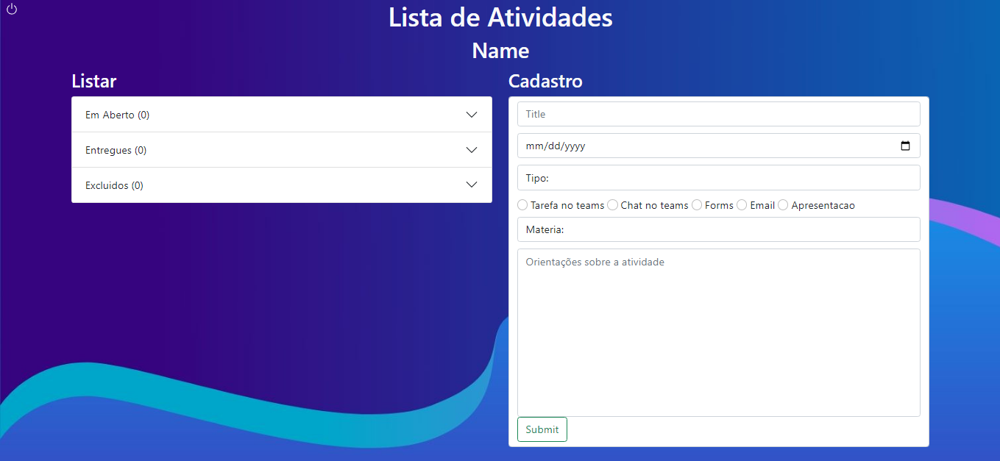

# To Do List

>Esse projeto se baseia em uma simples lista de tarefas que foi feita com o intuito de aprender como interagir com o banco de dados e melhorar meu uso de bootstrap

## 📝 Licença

Esse projeto está sob licença. Veja o arquivo [LICENÇA](LICENSE) para mais detalhes.
